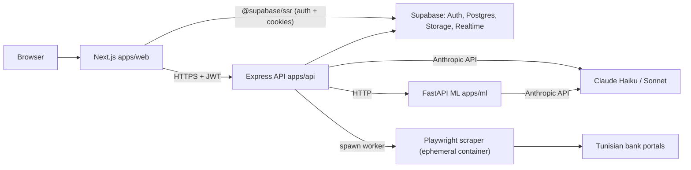
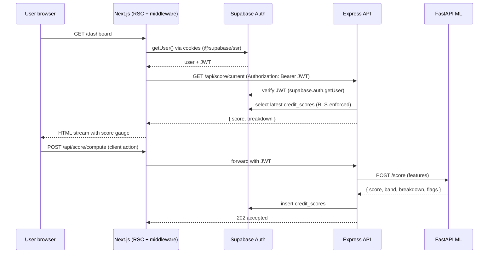

# Klaro Architecture (Web-first)

> **Scope change:** the React Native mobile app planned in `internal_docs/06_Updated_Architecture_TechStack.md` has been deferred. Klaro now ships as a Next.js web app for both end users and bank operators. The monorepo keeps `packages/shared` so a future `apps/mobile` can be added without API or schema changes.

This document supersedes the React Native sections of `internal_docs/06_Updated_Architecture_TechStack.md`. Everything else from that document (KYC pipeline, AI model routing, scoring engine, scraping playbook, Supabase schema, security audit) remains the canonical source of truth.

---

## 1. System overview



Three deployable services, one shared schema, one shared TypeScript contract package.

---

## 2. Monorepo layout

```
apps/web        Next.js 15 (App Router, RSC, Tailwind, shadcn-style UI)
apps/api        Express 4 + TypeScript (auth, scoring, scraping orchestration, chat proxy)
apps/ml         FastAPI 3.11 (KYC, OCR, 3-layer scoring)
packages/shared TS types, Zod schemas, API endpoints, API client, AI model map
packages/ui     Shared UI helpers
packages/eslint-config + tsconfig  Shared toolchain presets
supabase/       Migrations, RLS policies, storage buckets
infra/docker/   Dockerfiles for api, web, ml, scraper
```

---

## 3. Web app (apps/web)

Stack: Next.js 15 App Router, React 19, TypeScript, Tailwind v3, shadcn-style components, TanStack Query, Zustand (client UI state only), `@supabase/ssr` for auth, Recharts for visualizations, `react-hook-form` + Zod for forms.

### Route groups

| Group         | Purpose                                                                              | Auth         |
| ------------- | ------------------------------------------------------------------------------------ | ------------ |
| `(marketing)` | Public landing & pricing                                                             | Public       |
| `(auth)`      | Login, register, email verification                                                  | Public       |
| `(app)`       | Authenticated user app: dashboard, KYC, bank connect, transactions, documents, chat  | `role=user`  |
| `(bank)`      | Bank operator console at `/bank/*`: list of consented users, score detail            | `role=bank`  |

Routing protection is enforced in two places:

1. `src/middleware.ts` (edge) — refreshes the Supabase session and redirects unauthenticated users.
2. Server components via `requireUser()` / `requireRole()` in `src/lib/auth.ts`.

### Request flow (typical user action)



---

## 4. API (apps/api)

Express 4 + TypeScript, ESM. Middleware order:

1. `helmet` (secure headers)
2. `cors` (allowlist from `CORS_ORIGINS`)
3. `express.json({ limit: '1mb' })`
4. `pino-http` request logging with credential redaction
5. `express-rate-limit` (general 120/min, auth 10/min, scrape 5/min)
6. Per-route Zod validation (`src/middleware/validate.ts`)
7. JWT verification via Supabase service-role client (`src/middleware/auth.ts`)
8. Routes
9. Centralized error handler

Routes:

| Mount               | Responsibility                                                                  |
| ------------------- | ------------------------------------------------------------------------------- |
| `/api/auth/*`       | `/me` introspection                                                             |
| `/api/kyc/*`        | Upload metadata, trigger ML verify                                              |
| `/api/scrape/*`     | Start / poll / cancel bank scrape jobs                                          |
| `/api/score/*`      | Latest score, history, on-demand compute                                        |
| `/api/chat/*`       | Send + SSE stream (Haiku input filter → Sonnet financial advisor)               |
| `/api/documents/*`  | List, upload metadata, delete (files in Supabase Storage)                       |
| `/api/bank/*`       | RBAC=`bank`. List consented clients, fetch score detail.                        |
| `/api/transactions` | Categorized transaction list                                                    |

**Bank credential handling.** Browser encrypts credentials with the API's RSA-OAEP public key (WebCrypto). API decrypts in memory only (`src/lib/crypto.ts`), passes to a Playwright worker spawned in an isolated container, then wipes the credential strings. Never persisted, never logged (Pino redaction enforces this).

---

## 5. ML sidecar (apps/ml)

FastAPI 3.11. Three concerns, each behind its own router:

- `/score` — composes Layer 1 (rule scorecard) + Layer 2 (PyOD IsolationForest, optional `ml` extra) + Layer 3 (Claude Sonnet) into a single `score`, `band`, `breakdown`, `flags`, `recommendations`, `confidence`. See `src/klaro_ml/scoring/compose.py`.
- `/kyc/liveness` and `/kyc/face-match` — MediaPipe + AdaFace stubs (`kyc` extra; heavy deps lazy-imported so the base image is small).
- `/ocr/extract` — PaddleOCR + Claude Haiku for structured field extraction.

The Python service is meant to be called only by the Express API on the private network. There is no auth on the FastAPI side beyond network isolation.

---

## 6. Supabase

Schema is defined under `supabase/migrations/`:

- `0001_init.sql` — `profiles`, `kyc_documents`, `bank_connections`, `transactions`, `credit_scores`, `anomaly_flags`, `bank_consents`, `chat_messages`, `audit_logs` plus auto profile trigger and `updated_at` trigger.
- `0002_storage.sql` — private buckets `kyc-docs`, `bank-statements`, `selfies` with owner-scoped policies (path convention `<bucket>/<user_id>/<filename>`).
- `0003_roles.sql` — `app_role` enum (`user`, `bank`, `admin`), `current_user_role()`, `has_role()`, plus bank-visibility policies on `credit_scores` and `profiles` gated by `bank_consents`.

RLS is enabled on every user-owned table. The Express API uses the service-role key only for cross-user operations (e.g. bank dashboards, audit log writes). Per-user reads/writes go through the user's JWT so RLS enforces ownership.

---

## 7. AI model routing

The model map lives in `packages/shared/src/constants/ai-models.ts` and is mirrored in `apps/ml/src/klaro_ml/settings.py` so both web/api and ml stay in sync.

| Task                       | Model                          | Why                            |
| -------------------------- | ------------------------------ | ------------------------------ |
| `transaction_categorize`   | `claude-haiku-4-5-20251001`    | High volume, classification    |
| `ocr_extract`              | `claude-haiku-4-5-20251001`    | Structured extraction          |
| `input_filter`             | `claude-haiku-4-5-20251001`    | Prompt-injection screening     |
| `financial_chat`           | `claude-sonnet-4-6`            | Synthesis, nuance              |
| `fraud_analysis`           | `claude-sonnet-4-6`            | Multi-document reasoning       |
| `score_coaching`           | `claude-sonnet-4-6`            | Personalized recommendations   |

---

## 8. Security checkpoints (from `internal_docs/05_Security_Vulnerability_Audit.md`)

- **No bank credential persistence.** Memory-only, RSA-OAEP envelope, wiped after use.
- **Pino redaction** on `req.headers.authorization`, `req.headers.cookie`, `*.password`, `*.token`, `*.encryptedCredentials`, `*.credential*`.
- **Strict CORS allowlist** via `CORS_ORIGINS`.
- **Helmet** sets HSTS, CSP-friendly defaults, X-Frame-Options, X-Content-Type-Options.
- **Per-tier rate limits** (`general`, `auth`, `scrape`).
- **RLS on every user-owned table.** Bank role only sees consented users.
- **Audit log** is service-role only; no direct user access.
- **Storage paths** are owner-scoped via `(storage.foldername(name))[1] = auth.uid()::text`.

---

## 9. Local development

```bash
pnpm install
cp .env.example .env
supabase start
pnpm db:migrate
pnpm gen:types
pnpm dev    # web → :3000, api → :4000, ml → :8000
```

See [`README.md`](README.md) for the full quickstart.
